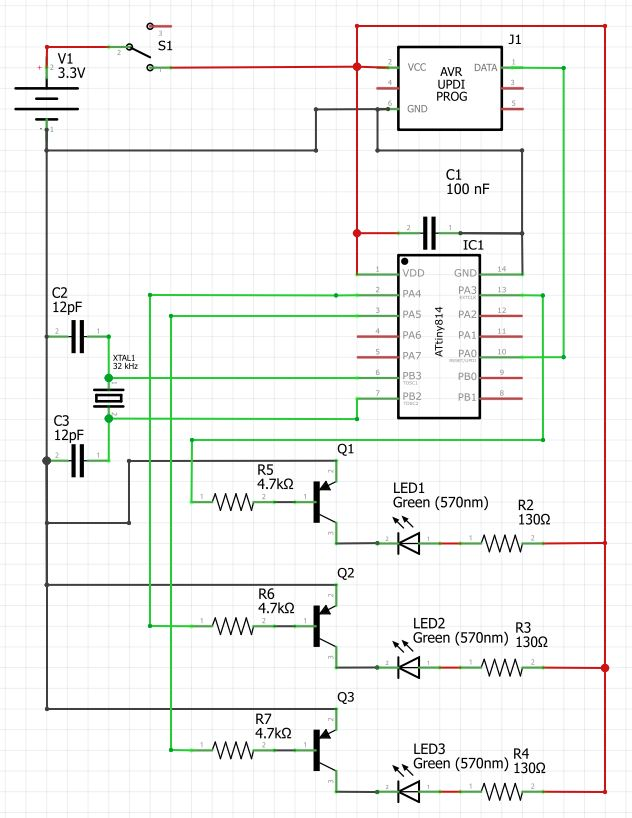

# Green Twinkler


This is a electronics test project with Microchips ATtiny814 for home decoration. The context is a fading light platform
with an integrated timer.

## Configuration

ON / OFF time interval can be adjusted by code

```c
#define OPERATION_TIME   21600L /* seconds (6 hours)  */
#define SLEEP_TIME       64800L /* seconds (18 hours) */
```

Also the blinking / fading interval is adjustable

```c
#define PERIOD          (100)
#define DUTY_MAX        (PERIOD)
#define DUTY_MIN        (5)
```

## Circuit diagram

  
_(Made with [Fritzing](https://fritzing.org/))_

## Parts list

- 1x ATtiny814-SSN
- 1x SOIC-14 to DIP-14 Adapter
- 1x ISP Socket (6-Pin)
- 3x LED Green (Ultrabright)
- 3x Resistor 68 R
- 1x Switch On/Off
- 1x Watch-Quarz 32,768 kHz
- 2x Ceramic Capacitor 12pF
- 1x Ceramic Capacitor 100nF
- 1x Batteryholder 2xAA

Total estimated costs: Lesser than **2,00 €** without batteries (10.03.2020)
